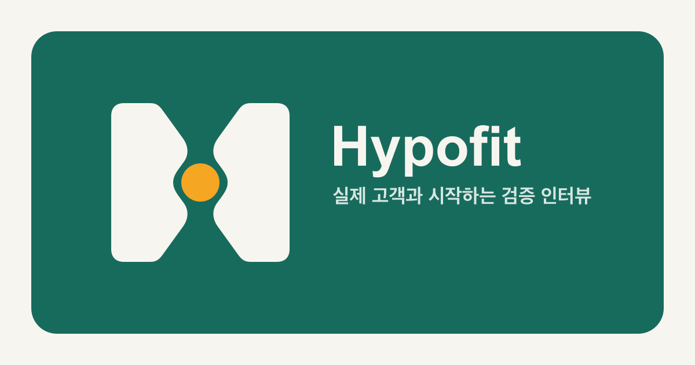

# Hypofit

<p align="left">
  
</p>

<p>
  초기 창업팀이 실제 타깃 고객을 빠르게 만나고,<br />
  사례비 기반 고객 인터뷰를 끝까지 진행하도록 돕는 인터뷰 매칭 서비스입니다.
</p>

<p>
  
  
  
</p>

<p>
  
</p>

## 고객을 만나야 가설을 검증할 수 있습니다

예비 창업자와 초기 창업팀은 제품을 만들기 전에 실제 고객의 문제와 행동을 확인해야 합니다.
하지만 인터뷰할 사람을 찾는 일은 생각보다 어렵습니다. 주변 지인만 만나면 의견이 편향될 수 있고,
온라인 커뮤니티에서 대상자를 구하면 조건 확인, 일정 조율, 사례비 안내가 여러 채널로 흩어집니다.

Hypofit은 인터뷰 대상자 모집부터 지원, 선정, 일정 조율, 인터뷰 완료까지 하나의 흐름으로 연결합니다.
창업자는 누구를 만나고 싶은지 명확하게 제시하고, 인터뷰어는 자신의 경험과 조건에 맞는 인터뷰를
찾아 참여할 수 있습니다.

## 누구를 위한 서비스인가요?

### 창업자

아이디어를 검증하고 싶은 예비 창업자와 초기 창업팀을 위한 도구입니다.

- 서비스와 가설에 맞는 타깃 고객을 모집합니다.
- 인터뷰 방식, 예상 시간, 사례비, 장소와 일정을 명확하게 안내합니다.
- 지원자의 관련 경험과 가능한 시간을 확인합니다.
- 지원자를 선정하거나 반려하고, 채팅으로 세부 일정을 조율합니다.
- 인터뷰 진행 결과와 노쇼 같은 이슈를 기록합니다.

### 인터뷰어

특정 서비스의 실제 타깃 고객이 되어 자신의 경험을 공유하고 싶은 사람을 위한 참여 공간입니다.

- 사례비, 소요 시간, 진행 방식과 위치를 확인한 뒤 지원합니다.
- 자신의 관련 경험과 가능한 시간을 전달합니다.
- 지원 상태와 선정 결과를 확인합니다.
- 선정된 이후 창업자와 채팅으로 일정과 방식을 조율합니다.
- 부적절한 모집글이나 사용자를 신고하고 차단할 수 있습니다.

한 계정으로 두 역할을 함께 사용할 수도 있습니다. 다른 인터뷰에 참여하면서 동시에 자신의 모집글을
운영할 수 있습니다.

## Hypofit의 인터뷰 흐름

```text
창업자가 모집글을 작성합니다
  -> 인터뷰어가 조건을 확인하고 지원합니다
  -> 창업자가 지원 정보를 검토합니다
  -> 선정 후 채팅으로 일정과 방식을 조율합니다
  -> 인터뷰를 진행합니다
  -> 완료, 문제 또는 노쇼 상태를 기록합니다
```

### 1. 조건이 분명한 모집글

창업자는 찾는 고객, 인터뷰 주제, 사례비, 예상 시간, 대면·비대면 방식, 위치와 가능한 일정을
모집글에 작성합니다. 인터뷰어가 지원 전에 자신에게 맞는 인터뷰인지 판단할 수 있도록 핵심 조건을
먼저 보여줍니다.

### 2. 여러 방식의 인터뷰 탐색

인터뷰어는 최신 모집글을 확인하거나 검색과 필터로 조건을 좁힐 수 있습니다. 대면 인터뷰는 지도에서
현재 위치와 검색 지역을 기준으로 살펴볼 수 있습니다.

### 3. 필요한 정보만 받는 지원

지원자는 모집 조건과 관련된 경험, 가능한 시간처럼 선정에 필요한 내용을 전달합니다. 창업자는 지원자
정보를 검토한 뒤 직접 선정 여부를 결정합니다.

### 4. 인터뷰에 연결된 채팅

채팅은 일반적인 메신저가 아니라 인터뷰 진행을 위한 조율 공간입니다. 어떤 모집글에서 시작된 대화인지,
현재 지원 상태가 무엇인지 확인하면서 일정과 진행 방식을 논의할 수 있습니다.

### 5. 완료까지 이어지는 상태 관리

신청, 선정, 일정 조율, 완료와 문제 상황을 하나의 흐름으로 관리합니다. 인터뷰 이후의 기록은 반복적인
노쇼와 부적절한 이용을 줄이고 더 신뢰할 수 있는 참여 경험을 만드는 기반이 됩니다.

## 주요 기능

- **인터뷰 모집글**: 타깃 고객, 사례비, 시간, 방식, 위치와 모집 인원을 명확하게 작성합니다.
- **검색과 필터**: 서비스, 타깃, 지역과 인터뷰 조건을 기준으로 모집글을 찾습니다.
- **지도 탐색**: 대면 인터뷰를 지도와 목록으로 비교합니다.
- **지원과 선정**: 관련 경험과 가능한 시간을 바탕으로 지원하고 결과를 확인합니다.
- **인터뷰 채팅**: 지원 이후 일정, 방식과 진행 상태를 한 대화 안에서 조율합니다.
- **내 인터뷰**: 신청한 인터뷰와 직접 만든 모집글을 각각 관리합니다.
- **알림**: 지원 상태, 채팅과 인터뷰 진행에 필요한 소식을 전달합니다.
- **신뢰와 안전**: 프로필, 신고, 차단, 문의, 계정 삭제와 인터뷰 결과 기록을 제공합니다.

## 제품 원칙

### 실제 인터뷰 성사에 집중합니다

Hypofit은 설문 제작 도구나 일반 구인 플랫폼이 아닙니다. 창업자가 적합한 고객을 만나 유의미한 대화를
완료하는 데 직접 필요한 기능을 우선합니다.

### 조건을 지원 전에 투명하게 보여줍니다

사례비, 시간, 장소와 진행 방식을 미리 확인할 수 있어야 합니다. 인터뷰어가 충분한 정보를 바탕으로
지원하고, 창업자도 적합한 지원자를 검토할 수 있도록 설계합니다.

### 중요한 판단은 사용자가 직접 합니다

추천이나 요약 기능이 추가되더라도 지원자의 선정과 반려는 창업자가 직접 결정합니다. 자동화가 사람에
대한 중요한 판단을 대신하지 않도록 합니다.

### 사례비 지급을 보증하지 않습니다

현재 Hypofit은 사례비 조건과 지급 상태를 조율하고 기록하지만, 에스크로나 자동 결제를 제공하지
않습니다. 지급과 관련된 문제는 신고와 운영 지원 절차를 통해 다룹니다.

### 신뢰와 안전을 기본 기능으로 봅니다

실제 만남과 사용자 간 대화가 발생하는 서비스이므로 신고, 차단, 문의, 개인정보 보호와 계정 삭제를
부가 기능이 아닌 기본 제품 범위로 다룹니다.

## 현재 서비스 상태

- iOS 앱은 App Store 출시 기준선 `1.0.0`을 운영하고 있습니다.
- Android 앱은 Google Play 출시를 준비하고 있습니다.
- 모바일 앱을 핵심 제품으로 운영하며, 웹에서는 서비스 소개와 데스크톱 이용 경험을 제공합니다.
- 공개 로그인은 소셜 로그인을 중심으로 제공합니다.
- 자동 결제, 에스크로, AI 자동 선정과 범용 설문 기능은 현재 제공하지 않습니다.

## 서비스 안내

- 웹사이트: [hypofit.bukae.co.kr](https://hypofit.bukae.co.kr)
- 문의: [ssamso8282@gmail.com](mailto:ssamso8282@gmail.com)
- 보안 제보: [SECURITY.md](SECURITY.md)
- 라이선스: [MIT License](LICENSE.md)
