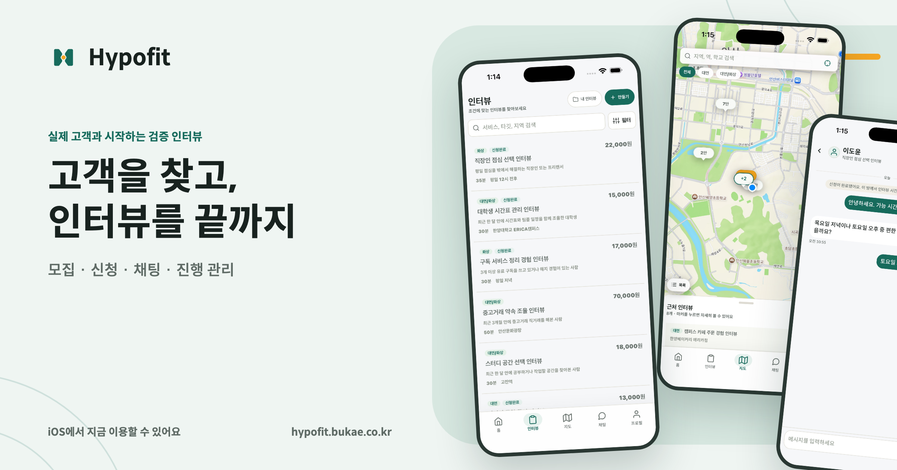
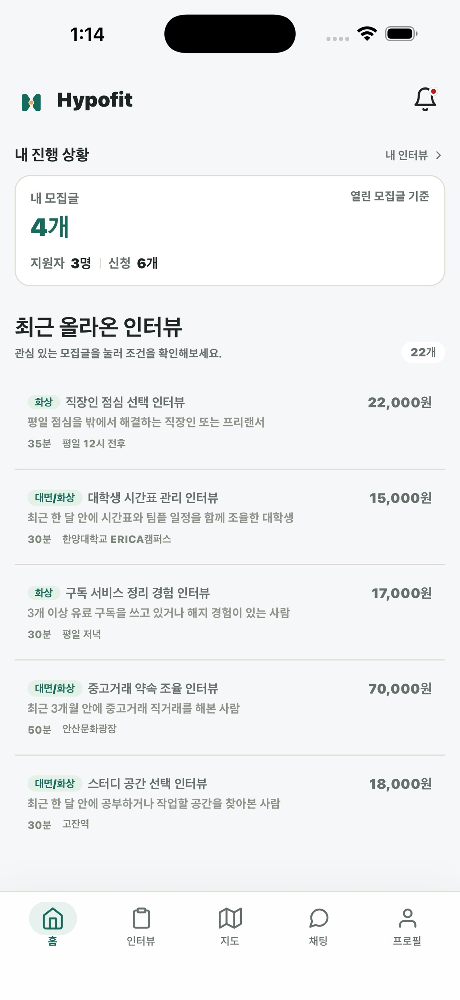
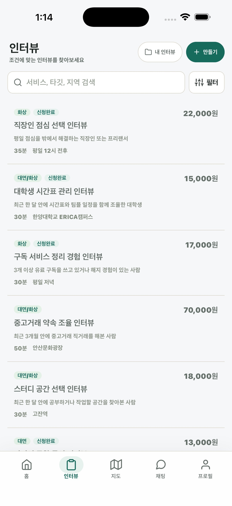
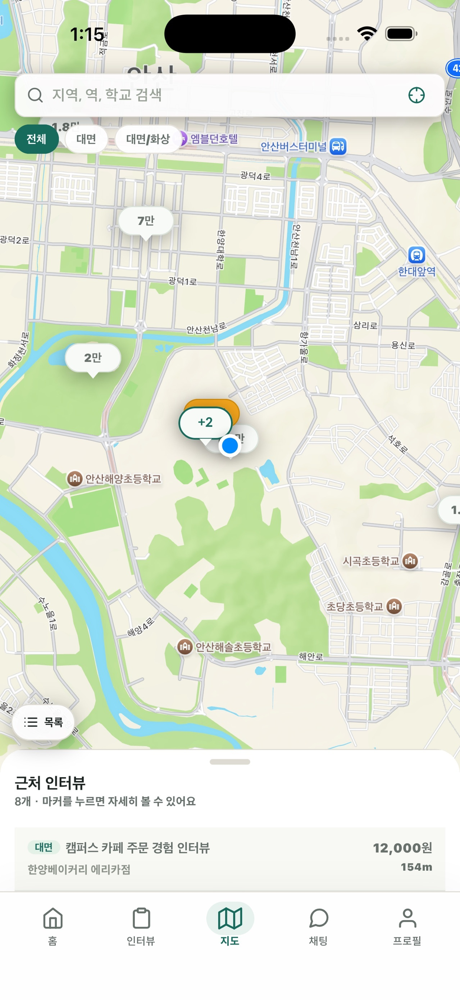
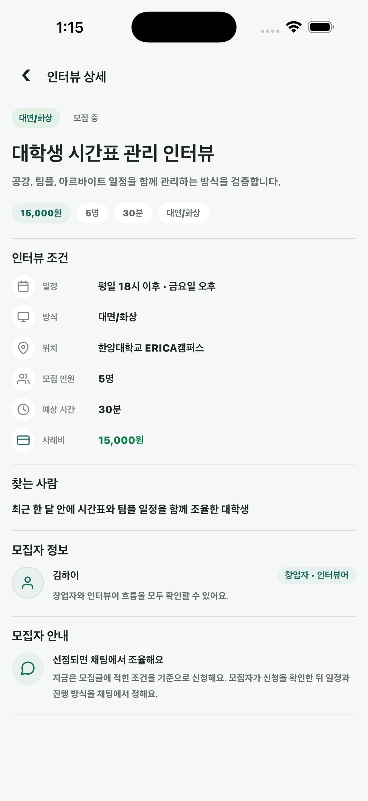
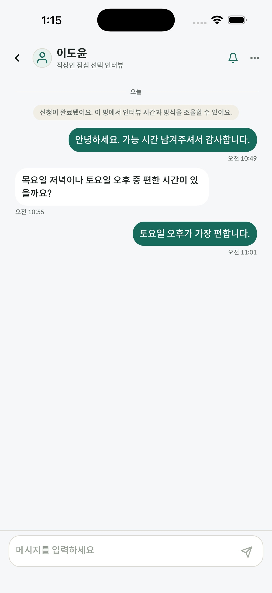
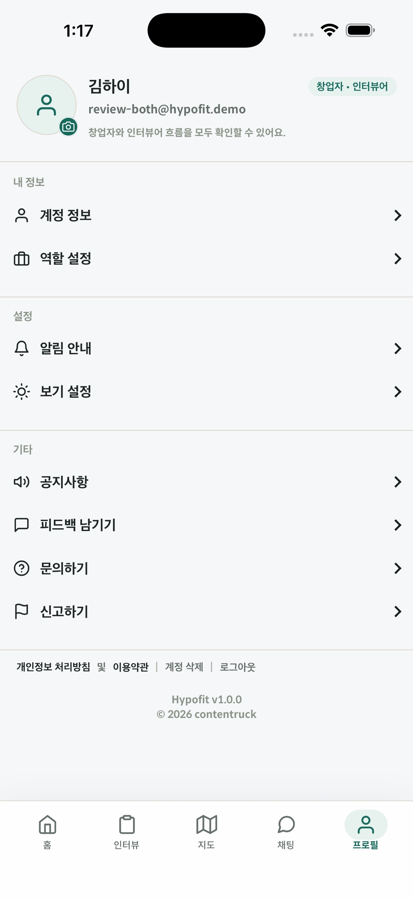

# Hypofit

고객 검증, 사용자 조사, 학술·현장 연구에 필요한 인터뷰 참여자를 찾는 서비스입니다.
모집부터 지원, 선정, 일정 조율과 완료까지 인터뷰 전 과정을 한곳에서 관리합니다.

  
  
  

  

  

  iPhone에서 지금 이용할 수 있습니다. Android 앱은 출시를 준비하고 있습니다.

## 앱 미리보기

<table>
  <tr>
    <td align="center" width="33%">
      
       
      <strong>홈</strong>
    </td>
    <td align="center" width="33%">
      
       
      <strong>인터뷰 찾기</strong>
    </td>
    <td align="center" width="33%">
      
       
      <strong>지도 탐색</strong>
    </td>
  </tr>
  <tr>
    <td align="center" width="33%">
      
       
      <strong>인터뷰 상세</strong>
    </td>
    <td align="center" width="33%">
      
       
      <strong>채팅으로 조율</strong>
    </td>
    <td align="center" width="33%">
      
       
      <strong>프로필과 설정</strong>
    </td>
  </tr>
</table>

## 누구를 위한 서비스인가요?

| 인터뷰 모집자 | 인터뷰 참여자 |
| --- | --- |
| 기업, 창업팀, 대학원생과 연구자가 목적과 조건에 맞는 참여자를 모집하고 지원자를 검토합니다. | 자신의 경험과 조건에 맞는 인터뷰를 찾아 지원합니다. |
| 고객 검증, 사용자 조사와 연구 인터뷰의 일정 및 진행 상태를 관리합니다. | 조건과 사례비를 확인하고 선정 후 일정을 조율합니다. |

인터뷰가 필요한 누구나 모집자로 이용할 수 있으며, 한 계정으로 모집과 참여를 함께 할 수 있습니다.

## 활용 예시

- 신제품과 신사업을 위한 고객 검증 인터뷰
- 제품 및 서비스 개선을 위한 사용자 조사
- 대학원과 연구기관의 학술·현장 연구 인터뷰
- 설문 결과의 배경과 맥락을 확인하는 후속 인터뷰

## 주요 기능

- **인터뷰 모집과 탐색**: 모집글 작성, 검색, 필터와 지도 탐색
- **지원자 검토와 선정**: 지원 정보 확인, 선정 결과와 진행 상태 관리
- **일정 조율과 진행**: 채팅, 상태 변경과 새 메시지 안내
- **신뢰와 안전**: 신고, 차단, 문의와 계정 관리

## 서비스 안내

- 웹사이트: [hypofit.bukae.co.kr](https://hypofit.bukae.co.kr)
- 문의: [ssamso8282@gmail.com](mailto:ssamso8282@gmail.com)
- 보안 제보: [SECURITY.md](SECURITY.md)
- 라이선스: [MIT License](LICENSE.md)
